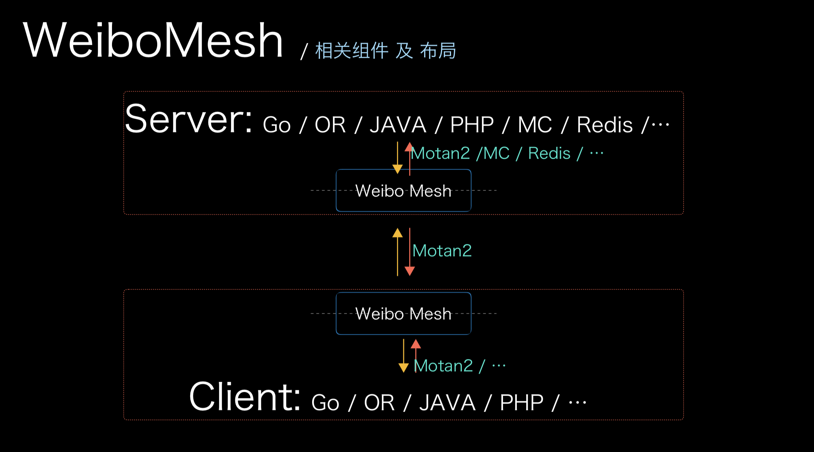

# 如何在 Golang 中使用 Weibo-Mesh


## 概要

本项目将演示一个在 Golang 中使用 Weibo-Mesh 的推荐使用姿势，主要由 Server、 Client、 Weibo-Mesh 三个部分组成。

Server 中提供了一个 `HelloWorldService` 的 `motan` RPC 服务，Client 在 9999 端口提供了一个 HTTP 服务，这个服务依赖
Server 提供的 `HelloWorldService` 服务，而服务的调用经由 Weibo-Mesh 完成，组件布局结构如下图。




## 核心关注点

在项目中使用 Weibo-Mesh 有以下两个核心关注点（这里以容器化部署为例进行演示，裸机环境原理一样，与使用的语言无关）：

1. 制作服务镜像时，Weibo-Mesh 以镜像的一层被加入到服务镜像中（Server、Client 的 Dockfile 中均有体现）
2. 容器运行中将包含两个进程（服务进程本身 和 Weibo-Mesh 进程），服务以后台进程方式启动，Weibo-Mesh 则作为容器的主进程


## 本项目运行说明

1. 直接执行根目录的 `run.sh` 脚本即可启动整个项目
2. 项目启动首先会创建一个名为 `weibo-mesh` 的容器网络
3. 启动 Server 端服务（并暴露 Server 侧 Mesh 的服务端口 `9100`，真正提供服务的 Server 本身端口为 `8100`，可在 `./server/server.yaml` 中看到 `export: "motan2:8100"` 的相关配置）
4. 启动 Client（暴露提供 HTTP 服务的 80 端口供访问测试）
5. 执行 `run.sh x` 则可停止所有服务并清理相关运行的容器和网络配置


## 相关键配置说明


### Server 配置（`./server/server.yaml`）


```yaml
motan-service:
  mytest-motan2:
    path: com.weibo.HelloWorldService       #所提供的服务
    ref : "main.HelloWorldService"          #提供服务的具体包
    export: "motan2:8100"                   #服务导出的端口
    basicRefer: test-basicService           #通用基础配置
```


### Server Mesh 配置（`./weibo-mesh/server-mesh.yaml`）


```yaml
motan-service:
  mytest-motan2:
    path: com.weibo.HelloWorldService       #所提供的服务
    export: "motan2:9100"                   #所导出的服务
    proxy: "motan2:8100"                    #真正服务提供的地址（本机的 8100 端口）
    basicRefer: test-mesh-basicService      #通用基础配置
```


### Client 配置（`./client/client.yaml`）


```yaml
motan-refer:
  hello-world:
    path: com.weibo.HelloWorldService       #所依赖的服务
    registry: "direct-registry"             #与本机的 Client Mesh 直连
    basicRefer: test-basicRefer             #通用基础配置
```


### Client Mesh 配置（`./weibo-mesh/client-mesh.yaml`）


```yaml
motan-refer:
  hello-world:
    path: com.weibo.HelloWorldService       #所依赖的服务
    registry: "test-zk"                     #与注册中心（zookeeper）通信，进行服务发现
    basicRefer: test-mesh-basicRefer        #通用基础配置
```


## 相关命令

```bash
#验证请求
curl 127.0.0.1

#查验 ZK 数据
docker run -it --rm --net weibo-mesh --link weibo-mesh-zk:zookeeper zookeeper zkCli.sh -server zookeeper
```